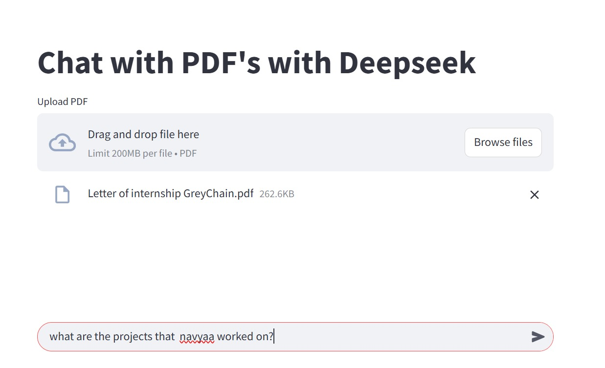

# Chat with PDF using LangChain, Ollama, FAISS, and Streamlit

A local AI-powered chatbot that allows you to **upload any PDF and chat with it** using natural language. Built with [LangChain](https://www.langchain.com/), [Ollama](https://ollama.com), FAISS, and Streamlit.

---

## Demo Screenshots

### Upload PDF

### Ask Questions

---

## Features

- Upload any PDF and extract context intelligently
- Retrieve the most relevant content using vector search (FAISS)
- Ask natural language questions
- Answers generated using a local LLM (`deepseek-r1`) via Ollama
- Completely local – no OpenAI/LLM APIs needed!

---

## Tech Stack

| Layer | Tech |
|-------|------|
| Frontend | Streamlit |
| Embeddings | Ollama + Deepseek |
| Vector Store | FAISS |
| PDF Processing | PyPDFLoader |
| Prompt Handling | LangChain |
| LLM (Local) | DeepSeek via Ollama |

---